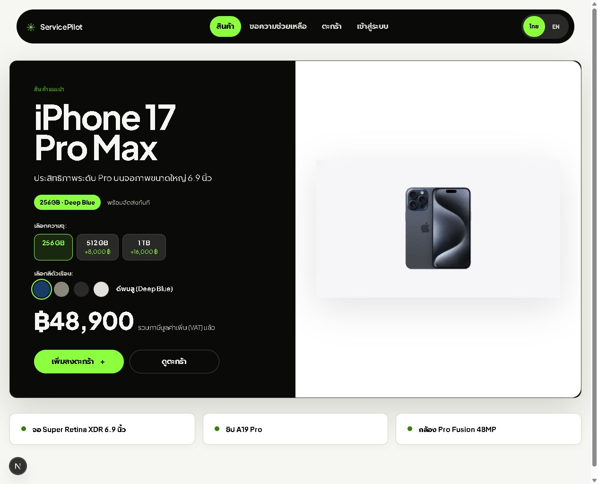
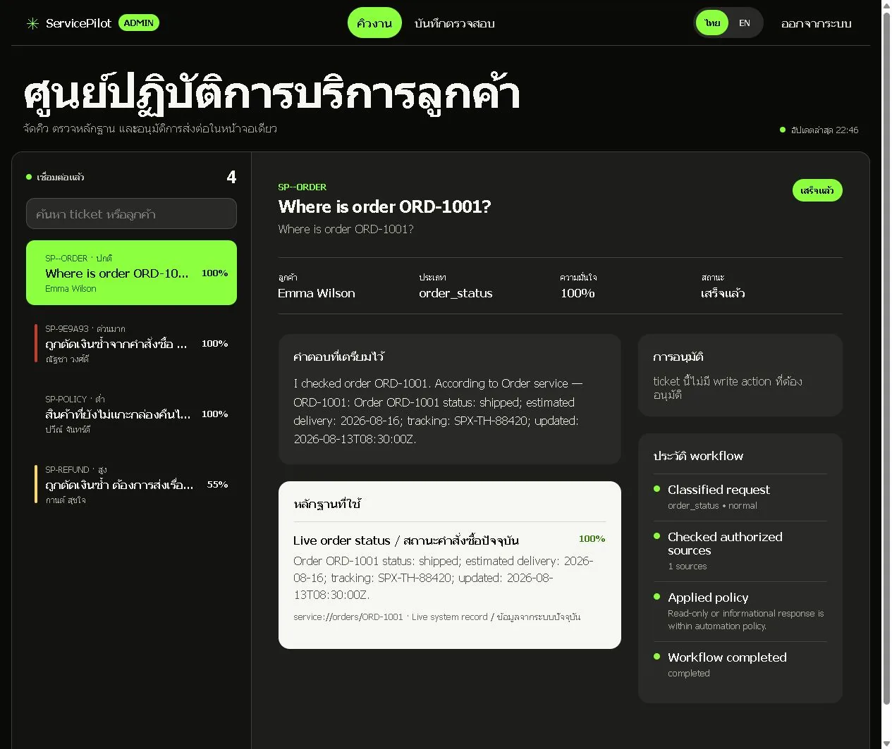
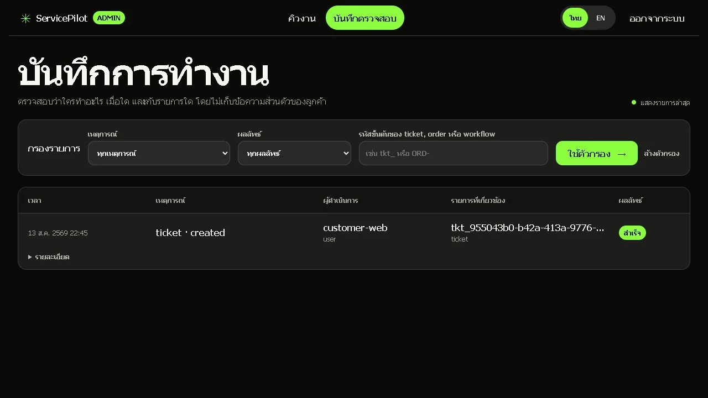
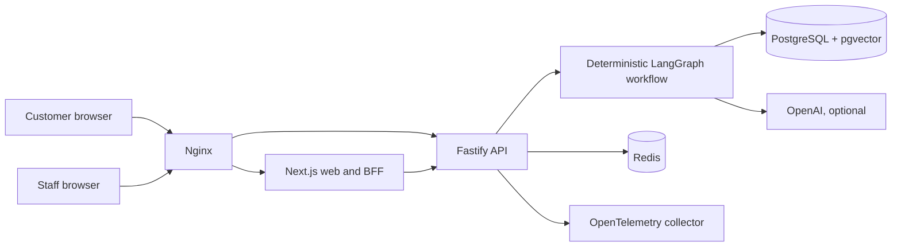
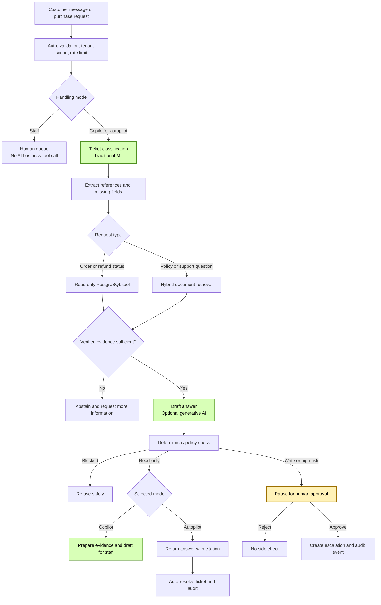

# ServicePilot AI

[](https://github.com/kingggg5/pilotai/actions/workflows/ci.yml)

ServicePilot AI is a production-oriented, bilingual customer service platform. Customers can create accounts, browse products, submit purchase requests, track orders, and open support tickets. Staff receive AI-assisted classification, grounded policy answers with page-level citations, live order/refund data, human approval controls, and an append-only audit trail.

The frontend and backend are TypeScript. PostgreSQL is the system of record, Redis provides distributed rate limiting, and Nginx is the only public container entry point.

## Product preview

### Storefront and purchase requests



The storefront reads product names, prices, source links, and image paths from PostgreSQL. The sample iPhone catalog entry is migration data, not a React fallback. ServicePilot is not presented as an authorized reseller; checkout creates a purchase request for staff confirmation before payment.

### Staff workspace



### Filterable audit log



## What the system does

- Supports Thai and English customer journeys with an explicit language switch.
- Registers customer accounts and stores password hashes using `scrypt`.
- Creates server-authoritative `ORD-*` purchase requests and support tickets.
- Classifies ticket topic and urgency with deterministic character n-gram Naive Bayes.
- Retrieves policy evidence with PostgreSQL full-text search, pgvector, and reranking.
- Returns page-level citations and refuses to invent an answer when evidence is weak.
- Runs read-only tools automatically: `get_order_status`, `check_refund_status`, and `search_policy`.
- Lets each customer choose staff-only handling, AI copilot, or bounded AI autopilot for every support request.
- Extracts order/refund references, asks for missing information, routes the ticket, sets priority/tags, and auto-resolves verified low-risk requests.
- Pauses write actions such as `create_escalation` until a human approves them.
- Exposes REST/OpenAPI as the primary interface with a thin MCP adapter.
- Records tenant-scoped, PII-redacted, append-only audit events.
- Includes JWT verification, signed webhooks, idempotency, Redis rate limiting, health checks, and OpenTelemetry.

## Architecture



Business rules live in services and the workflow layer, not in route handlers or UI components. Repository interfaces isolate PostgreSQL from domain logic. Filters and parsers are pure functions so they can be tested independently.

### AI decision flow



Green nodes use AI or machine learning. The approval node is a human decision. Every other node is deterministic application code or a database operation.

| Part | Uses AI? | Production behavior |
| --- | --- | --- |
| Ticket category and urgency | Yes, traditional ML | Local character n-gram Naive Bayes; no external model call |
| Policy/document retrieval | Optional | PostgreSQL full-text + pgvector; the default hash embedder is local and non-generative, while `EMBEDDING_PROVIDER=openai` enables OpenAI embeddings |
| Response drafting | Optional generative AI | OpenAI Responses API only when `AI_MODE=openai` and verified evidence exists; `store: false`; local template mode is the default |
| LangGraph workflow | No | Typed orchestration, pause/resume, and state transitions only |
| Policy and security decisions | No | Deterministic rules can refuse unsafe requests or require approval |
| Order/refund lookup | No | Tenant-scoped, read-only repository calls |
| Escalation/write action | No autonomous AI | A human must approve before the repository write runs |
| Auth, rate limiting, audit, metrics | No | Deterministic infrastructure and application controls |

The selected handling mode is persisted with the ticket and audit trail. It never weakens policy: the language model cannot authorize a write action, choose tenant access, or bypass the evidence threshold. See [AI flow and trust boundaries](./docs/ai-flow.md) for the full execution contract.

## Technology stack

| Layer | Technology |
| --- | --- |
| Web | Next.js 16, React 19, TypeScript, Tailwind CSS 4 |
| API | Fastify 5, Zod 4, TypeScript, Node.js 22 |
| Workflow | One deterministic LangGraph.js graph |
| AI | OpenAI JavaScript SDK; deterministic local mode for development and tests |
| Data | PostgreSQL 17, pgvector, Redis 8 |
| Gateway | Nginx 1.29 |
| Operations | Docker Compose, OpenTelemetry, GitHub Actions, Promptfoo |

## Repository layout

```text
apps/
  api/
    src/repositories/   repository contracts and PostgreSQL adapters
    src/routes/         REST/OpenAPI modules
    src/                domain services, workflow, security, telemetry
    tests/              unit and integration tests
  web/
    app/                customer, account, and staff routes
    components/         focused UI components
    lib/                API adapter, auth, filters, i18n, validation
docs/                   architecture and screenshots
evals/                  golden data, deterministic evaluations, Promptfoo
infra/                  Nginx, PostgreSQL migrations, OTel collector
scripts/                development, release checks, deployment, quality gate
compose.yaml            shared runtime definition
compose.override.yaml   development-only exposed ports
compose.production.yaml production secrets and resource limits
```

## Quick start

The project commands use a small Node.js CLI, so the same workflow works on Windows, macOS, and Linux. PowerShell files under `scripts/` remain only as legacy compatibility wrappers; new automation should use `npm run`.

### Requirements

- Node.js 22 or newer and npm
- Docker Desktop or Docker Engine with Docker Compose v2
- Windows, macOS, or Linux
- At least 4 GB of available RAM and 6 GB of free disk space

### 1. Configure the local environment

```powershell
Copy-Item .env.example .env.local
```

The default `AI_MODE=local` keeps customer messages on the machine and does not require an API key. To use OpenAI, set `AI_MODE=openai` and provide `OPENAI_API_KEY` to the API after approving data egress under your organization policy. Catalog access, purchase triage, and hash embeddings continue to work without OpenAI embeddings.

### 2. Start the stack

```powershell
npm run dev
```

Use a different port when 8080 is occupied:

```powershell
npm run dev -- --port 8180
```

Docker Compose runs the PostgreSQL migration before the API and waits for the PostgreSQL, Redis, API, Web, and Nginx health checks. Do not delete volumes to repair a migration; add an idempotent migration and preserve the data.

### 3. Open the application

| Path | Purpose |
| --- | --- |
| `/` | Product catalog |
| `/cart` | Browser cart and purchase request checkout |
| `/account/register` | Customer registration |
| `/account/login` | Customer login |
| `/account` | Profile, tickets, and linked orders |
| `/support` | Authenticated ticket creation |
| `/admin/login` | Staff login |
| `/admin` | Ticket queue, AI evidence, and human approval |
| `/admin/audit` | Filterable audit events |
| `/docs` | Swagger UI |
| `/health/live` | Process liveness |
| `/health/ready` | Dependency readiness |

The local staff password is the value of `SERVICEPILOT_ADMIN_PASSWORD` in `.env.local`.

### 4. Stop the stack

```powershell
docker compose down
```

Do not add `-v` unless you intentionally want to delete local PostgreSQL and Redis data.

## User journeys

### Customer

1. Register at `/account/register` or sign in at `/account/login`.
2. Update the profile at `/account`; sessions use an HttpOnly cookie.
3. Add a product to `/cart` and submit a purchase request to create an order and AI-triaged ticket.
4. Open `/support` for a support request. The server attaches the authenticated customer ID, email, and phone number.
5. Return to `/account` to track linked orders and ticket history.

### Staff

1. Sign in at `/admin/login` with the bootstrap password.
2. Filter by search text, ticket/order number, date range, priority, status, channel, or sort order.
3. Review customer details, classification, citations, live tool output, and workflow trace.
4. Update the team, status, or priority. Every mutation produces an audit event.
5. Approve or reject write actions with an operator note.
6. Use `/admin/audit` to investigate actor, outcome, resource, and event type.

Read-only actions can run automatically. Write actions have no side effect before approval.

## Quality and evaluation

Run the complete release check:

```powershell
npm run check
```

It runs:

- Repository P1/P2/P3 quality gate and contract test
- API typecheck, tests, and production build
- Classifier, retrieval, and workflow golden evaluations
- Frontend lint, typecheck, tests, and production build
- Development and production Compose validation

Run only the fast repository scan:

```powershell
node scripts/quality/vibe-check.mjs `
  --json work/quality-gate-report.json `
  --fail-on high
```

The local gate is inspired by [CodeVibes](https://github.com/danish296/codevibes): P1 Security, P2 Bugs & Performance, P3 Code Quality, and a severity-weighted score from 0 to 100. This implementation is deterministic, dependency-free, redacts credential evidence, sends no source code to an external model, and blocks CI on High or Critical findings. The score is a fast heuristic; it complements tests, evaluation datasets, review, and runtime monitoring rather than replacing them.

Evaluation reports include Macro-F1, precision, recall, confusion data, Recall@K, MRR, citation accuracy, and workflow policy checks. Synthetic classifier scores are regression signals, not substitutes for a de-identified production dataset with time-based splits and per-class support review.

## AI roadmap

The first automation increment now adds a per-ticket Staff / Copilot / Autopilot choice, extracts references, asks missing-information questions, routes teams, sets priority/tags, records mode and automation audit events, and auto-resolves only low-risk requests backed by verified evidence. The next improvements are grounded staff summaries, duplicate detection, reviewer feedback, and production cost/latency monitoring. The model never chooses tenant access or authorizes a high-risk write. See [the AI roadmap](./docs/ai-roadmap.md) and run the baseline with:

```sh
npm run ai:eval
```

## Production deployment

Place a managed load balancer, ingress, or CDN with TLS in front of Nginx. Inside Compose, only Nginx publishes a port; PostgreSQL, Redis, API, and Web stay on private networks.

### 1. Generate production configuration and secrets

```powershell
npm run init:production -- --origin https://support.example.com --tenant tenant-company --port 8080
```

The script prompts securely for the OpenAI key and creates:

- `.env.production` for non-secret deployment values
- `.secrets/*` for database, JWT, webhook, staff, session, and OpenAI credentials

The files are ignored by Git and mounted read-only into the services that need them. Compose file secrets are not encrypted at rest. Store `.secrets` on encrypted storage or replace it with your platform secret manager, and maintain an encrypted backup.

Retrieve the one-time bootstrap password only on the deployment host:

```powershell
Get-Content .secrets/admin_password
```

Never send credentials through chat or include them in screenshots.

### 2. Deploy

```powershell
npm run deploy
```

Enable the OpenTelemetry collector profile when required:

```powershell
npm run deploy -- --observability
```

### 3. Verify

```powershell
Invoke-WebRequest https://support.example.com/health/live
Invoke-WebRequest https://support.example.com/health/ready
docker compose --env-file .env.production `
  -f compose.yaml -f compose.production.yaml ps
docker compose --env-file .env.production `
  -f compose.yaml -f compose.production.yaml logs -f --tail=200 api web nginx
```

All long-running services should be healthy and both health endpoints should return HTTP 200.

## Backup and restore

PostgreSQL is the system of record. Redis contains rate-limit and runtime state and is not the primary backup target.

Create a custom-format PostgreSQL backup:

```powershell
New-Item -ItemType Directory -Force backups | Out-Null
docker compose --env-file .env.production `
  -f compose.yaml -f compose.production.yaml `
  exec -T postgres pg_dump -U servicepilot -d servicepilot `
  --format=custom --file=/tmp/servicepilot.dump
docker compose --env-file .env.production `
  -f compose.yaml -f compose.production.yaml `
  cp postgres:/tmp/servicepilot.dump ./backups/servicepilot.dump
```

Test restoration in an isolated environment:

```powershell
docker compose cp ./backups/servicepilot.dump postgres:/tmp/servicepilot.dump
docker compose exec -T postgres pg_restore `
  -U servicepilot -d servicepilot --clean --if-exists /tmp/servicepilot.dump
```

Define backup schedules, retention, encryption, off-site copies, and tested RPO/RTO values for your environment.

## Upgrade and rollback

Before an upgrade:

1. Run `npm run check`.
2. Back up PostgreSQL and deployment secrets.
3. Create a Git tag/release and update `DEPLOYMENT_VERSION`.
4. Run `npm run deploy`.
5. Verify health, error rate, latency, and one real ticket journey.

To roll back, check out the previous release, restore the backup when a migration is not backward compatible, and deploy again. Never delete named volumes as a recovery shortcut.

## Production checklist

- [ ] Domain and TLS are configured; `WEB_ORIGIN` uses HTTPS.
- [ ] `.secrets` is encrypted at rest or replaced by a secret manager.
- [ ] Bootstrap credentials are rotated; OIDC/SSO is used for multiple staff users.
- [ ] Firewall rules expose only the TLS entry point.
- [ ] Backup and restore have been tested against defined RPO/RTO targets.
- [ ] Real policy documents are loaded into the correct tenant and citations are reviewed.
- [ ] An OTLP backend and dashboards cover traces, errors, latency, and AI cost.
- [ ] Promptfoo runs only against an isolated tenant and credential set.
- [ ] Peak load is tested and alerts are tied to service-level objectives.
- [ ] Ticket, audit, and trace retention comply with PDPA and company policy.

See [the architecture and threat model](./docs/architecture.md) for detailed design decisions.

## GitHub release hygiene

The target repository is [kingggg5/pilotai](https://github.com/kingggg5/pilotai). Before every push:

```powershell
npm run check
git status --ignored
```

`.env.local`, `.env.production`, `.secrets/`, backups, work files, logs, build output, dependency folders, and local caches are ignored. Screenshots under `docs/images/` are intentional project documentation.

Never commit an API key, password, database URL, private key, or production secret. Stop immediately and rotate the credential if one appears in staged files or Git history.
