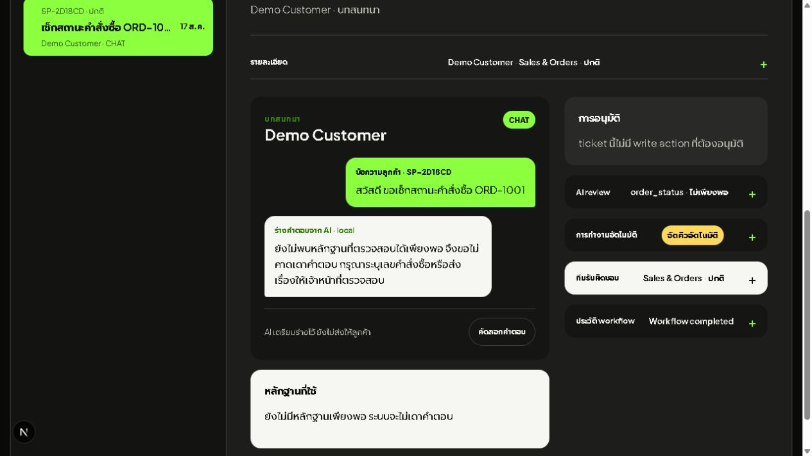
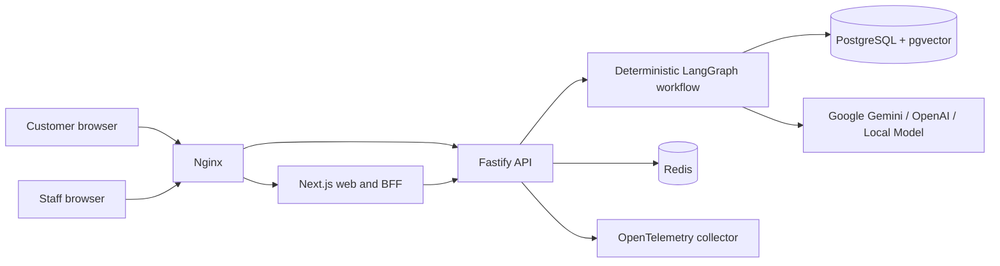
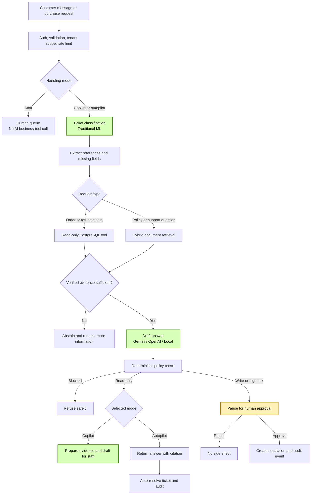

# ServicePilot AI (ภาษาไทย)

[](https://github.com/kingggg5/pilotai/actions/workflows/ci.yml)

ServicePilot AI คือแพลตฟอร์มบริการลูกค้าอัจฉริยะสองภาษา (ไทย/อังกฤษ) ระดับ Production-Ready ที่ออกแบบมาเพื่อรองรับกระบวนการทำงานจริงของธุรกิจ ลูกค้าสามารถสร้างบัญชีผู้ใช้ ค้นหาสินค้า ส่งคำขอสั่งซื้อ ติดตามสถานะคำสั่งซื้อ และเปิดคำร้องเรียน/สอบถามปัญหา (Support Tickets) โดยมีระบบ AI ช่วยจำแนกประเภท ค้นหานโยบายที่เกี่ยวข้องพร้อมอ้างอิงรายหน้า (Citations) ดึงข้อมูลคำสั่งซื้อและคืนเงินแบบเรียลไทม์ พร้อมระบบควบคุมการอนุมัติโดยมนุษย์ (Human-in-the-Loop) และบันทึกประวัติการทำงานแบบแก้ไขไม่ได้ (Immutable Audit Trail)

ระบบพัฒนาด้วย TypeScript ทั้งส่วนหน้าและส่วนหลัง ใช้ PostgreSQL 17 เป็นฐานข้อมูลหลัก Redis สำหรับ Rate Limiting แบบกระจาย และ Nginx เป็น Reverse Proxy สำหรับทางเข้าหลัก

## ภาพตัวอย่างเว็บ




---

## ภาพรวมความสามารถของระบบ

- รองรับการใช้งาน 2 ภาษาทั้งภาษาไทยและอังกฤษ พร้อมปุ่มสลับภาษา
- ระบบลงทะเบียนและยืนยันตัวตนลูกค้าด้วยการเข้ารหัสผ่านแบบ `scrypt`
- สร้างคำขอซื้อสินค้าและเปิด Ticket ด้วยหมายเลขอ้างอิงระดับ Server `ORD-*`
- จำแนกประเภทและระดับความเร่งด่วนของ Ticket ด้วยโมเดล Naive Bayes (Character n-gram) ภายในเครื่อง
- ค้นหาข้อมูลนโยบายอ้างอิงด้วย PostgreSQL Full-text Search, pgvector และ Reranking
- แสดงแหล่งอ้างอิงระดับหน้า (Page-level Citations) และปฏิเสธการแต่งข้อมูลเมื่อหลักฐานไม่เพียงพอ
- ตอบคำถามทั่วไป เช่น คำทักทาย ความสามารถของระบบ และความรู้ทั่วไป โดยไม่ส่งเข้าคิวเจ้าหน้าที่; เรื่อง Order, การเงิน, ลูกค้า และข้อมูลส่วนตัวยังคงต้องมีหลักฐานที่ยืนยันได้
- เรียกใช้งาน Read-only Tools อัตโนมัติ: `get_order_status`, `check_refund_status` และ `search_policy`
- ลูกค้าสามารถเลือกรูปแบบการประมวลผลได้ต่อ Ticket: เจ้าหน้าที่เท่านั้น (Staff Only), ผู้ช่วย AI (Copilot), หรือ AI อัตโนมัติ (Autopilot)
- ดึงหมายเลขอ้างอิง สอบถามข้อมูลที่ขาดหาย มอบหมายทีมงาน กำหนดลำดับความสำคัญ และปิดเคสความเสี่ยงต่ำที่ยืนยันแล้วอัตโนมัติ
- หยุดพักคำสั่งที่มีการเขียนข้อมูล (เช่น `create_escalation`) ไว้ชั่วคราวเพื่อรอการอนุมัติจากเจ้าหน้าที่
- ใช้ขอบเขต Provider ที่ชัดเจน: ค่าเริ่มต้นเป็นโหมด Local แบบ Deterministic และเลือกใช้ OpenAI Responses API, Google Gemini หรือ Groq ได้ด้วย `AI_MODE` โดยโมเดล free-plan ที่ใช้คือ `llama-3.1-8b-instant`
- แดชบอร์ดตัวชี้วัดประสิทธิภาพแบบเรียลไทม์ (Operational KPI Dashboard): คำนวณ Zero-Touch Resolution Rate %, อัตราการช่วยเหลือโดยมนุษย์, เวลาและงบประมาณที่ประหยัดได้จริง, คะแนน CSAT และการกระจายตัวของอารมณ์ลูกค้า
- ระบบสตรีมมิง Server-Sent Events (SSE): สตรีมขั้นตอนการวิเคราะห์ หลักฐานที่พบ และเนื้อหาคำตอบทีละ Token แบบเรียลไทม์
- ระบบบันทึกฟีดแบ็กจากเจ้าหน้าที่ (Human-in-the-Loop Feedback): บันทึกข้อความที่เจ้าหน้าที่แก้ไขและคะแนนประเมินเพื่อใช้เป็นข้อมูลปรับปรุงโมเดลอย่างต่อเนื่อง
- ความปลอดภัยระดับองค์กร: การตรวจสอบสิทธิ์ด้วย JWT, Signed Webhooks, Idempotency ป้องกันคำขอซ้ำ, Redis Rate Limiting และ OpenTelemetry

---

## สถาปัตยกรรมระบบ (Architecture)



กฎทางธุรกิจทั้งหมดถูกจัดเก็บไว้ใน Layer Services และ Workflow โดยแยกออกจาก Route Handlers และ UI Components ชัดเจน มี Interface Repository ขั้นกลางระหว่าง PostgreSQL กับ Domain Logic เพื่อความง่ายในการทดสอบและบำรุงรักษา

### โมเดลที่ใช้ตอบแชตในแต่ละโหมด

ค่าเริ่มต้นสำหรับ development และ test คือ `AI_MODE=local`: `ts-char-ngram-naive-bayes-v2` ใช้จำแนกหัวข้อ/ความเร่งด่วน, `LocalLanguageModel` ใช้สร้างร่างคำตอบแบบ grounded และ `hash-char-gram-v2` ใช้ทำ embedding ภายในเครื่อง หากตั้ง `AI_MODE=groq` จะใช้ `GROQ_MODEL` (ค่าเริ่มต้น `llama-3.1-8b-instant`), `AI_MODE=openai` จะใช้ `OPENAI_MODEL` (ค่าเริ่มต้น `gpt-5.6-luna`) หรือ `AI_MODE=gemini` จะใช้ `GEMINI_MODEL` (ค่าเริ่มต้น `gemini-flash-latest`) โดย production รองรับ OpenAI หรือ Groq และทุก write action ยังต้องผ่าน Policy และการอนุมัติจากมนุษย์

คำถามทั่วไปจะใช้เส้นทาง `general-conversation-v1` แยกจากข้อมูลบริษัท: Provider ภายนอกสามารถตอบความรู้ทั่วไปได้อย่างเป็นธรรมชาติ ส่วนโหมด local ใช้คำตอบ deterministic ที่ไม่เดาข้อมูลสดหรือข้อมูลเฉพาะเรื่อง และจะถามบริบทเพิ่มเมื่อจำเป็น

### โฟลว์การตัดสินใจของ AI (AI Decision Flow)



---

## เทคโนโลยีที่ใช้งาน (Technology Stack)

| ส่วนของระบบ | เทคโนโลยี |
| --- | --- |
| Frontend Web | Next.js 16, React 19, TypeScript, Tailwind CSS 4 |
| Backend API | Fastify 5, Zod 4, TypeScript, Node.js 22 |
| State Machine Orchestrator | LangGraph.js |
| AI Integration | Local deterministic template (ค่าเริ่มต้น), Groq, OpenAI Responses API หรือ Google Gemini API โดยเลือกผ่าน `AI_MODE` |
| ฐานข้อมูล | PostgreSQL 17, pgvector, Redis 8 |
| Gateway & Reverse Proxy | Nginx 1.29 |
| Operations & Telemetry | Docker Compose, OpenTelemetry, GitHub Actions, Promptfoo |

---

## การเริ่มต้นใช้งาน (Quick Start)

### ความต้องการของระบบ:
- Node.js 22 ขึ้นไป และ npm
- Docker Desktop หรือ Docker Engine พร้อม Docker Compose v2
- ระบบปฏิบัติการ Windows, macOS หรือ Linux
- RAM ว่างอย่างน้อย 4 GB และพื้นที่จัดเก็บ 6 GB

### 1. คัดลอกไฟล์การตั้งค่าสภาพแวดล้อม
```powershell
Copy-Item .env.example .env.local
```

### 2. กำหนดค่า Google Gemini API (ฟรี 100%)
เพื่อเปิดใช้งาน AI จริงด้วย Google Gemini ให้ใส่ค่าใน `.env.local`:
```env
AI_MODE=gemini
GEMINI_API_KEY=ใส่คีย์ของคุณที่นี่
GEMINI_MODEL=gemini-flash-latest
```

### 3. รันระบบทั้งหมด
```powershell
npm run dev
```

### 4. เส้นทางใช้งานในระบบ (Application Routes)

| URL Path | วัตถุประสงค์ |
| --- | --- |
| `/` | หน้าร้านค้าและแสดงรายการสินค้า |
| `/cart` | รถเข็นสินค้าและการส่งคำสั่งซื้อ |
| `/account/register` | ลงทะเบียนบัญชีลูกค้าใหม่ |
| `/account/login` | เข้าสู่ระบบลูกค้า |
| `/account` | จัดการโปรไฟล์และดูประวัติคำสั่งซื้อ/Ticket |
| `/support` | Live chat สำหรับคุยกับ AI, ตรวจคำสั่งซื้อ และขอเจ้าหน้าที่ |
| `/admin/login` | เข้าสู่ระบบสำหรับเจ้าหน้าที่ |
| `/admin` | จัดการ Queue, ดู KPI Metrics, ตรวจสอบหลักฐาน AI และอนุมัติเคส |
| `/admin/audit` | บันทึกประวัติ Audit Log แบบแก้ไขไม่ได้ |

---

## การทดสอบและประเมินคุณภาพ (Quality & Evaluation)

รันคำสั่งตรวจสอบคุณภาพทั้งระบบ:
```powershell
npm run check
```

คำสั่งนี้จะรันการตรวจสอบ:
1. การสแกนความปลอดภัยและช่องโหว่ (P1/P2/P3 Quality Gate)
2. Typecheck, Unit Tests (27/27 tests) และ Production Build ของ API
3. AI Evaluators (Classifier F1-Score, RAG Recall@k, Automation Match, Golden Suite)
4. Lint, Typecheck, Unit Tests และ Next.js Production Build ของ Web
5. การตรวจสอบความถูกต้องของไฟล์ Docker Compose ทั้งชุด Development และ Production

---

## ข้อมูล Repository บน GitHub

- **Repository:** [kingggg5/pilotai](https://github.com/kingggg5/pilotai)
- โค้ดได้รับการปรับปรุง ตรวจสอบความปลอดภัย และรวมไว้ใน Branch `main` เพียง Branch เดียว พร้อมใช้งานสำหรับการพรีเซนต์และสมัครงาน
